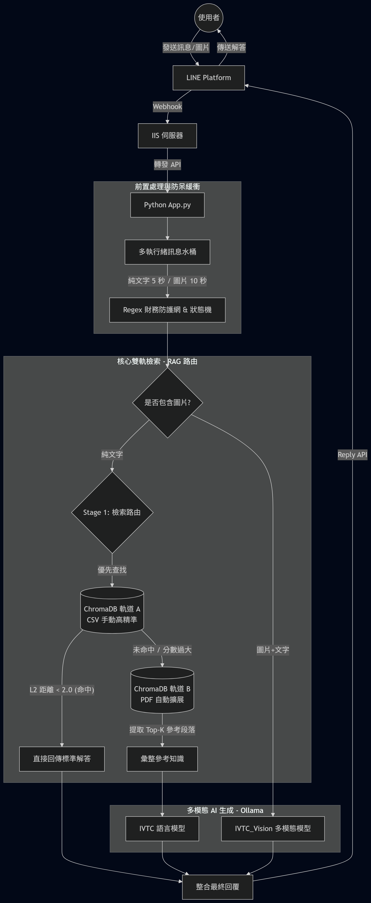

# LINE 官方 AI 客服系統demo (RAG 雙軌架構)

此專案為解決企業既有知識庫稀疏、傳統客服機器人回覆不精準的痛點，主導規劃並從零開發具備 RAG (檢索增強生成) 能力的 LINE AI 客服系統。

## 系統架構圖

## 核心技術與亮點

* **雙軌 RAG 檢索架構：** 整合 Ollama 與 ChromaDB，設計「高精準 A 軌」與「模糊擴展 B 軌」檢索機制，動態調整 L2 距離閾值，確保回答極高準確率。
* **Vision 多模態防幻覺：** 實作圖片 Base64 轉換，採用「先解析、後客服」的兩段式 Prompt Engineering，有效防止 AI 產生幻覺。
* **高併發與狀態管理：** 開發多執行緒 (Threading) 訊息緩衝機制，解決使用者「碎語」造成的 API 頻繁呼叫問題；並實作 SQLite 持久化記憶與超時狀態機 (Daemon Thread)。
* **業務防護網 (Guardrails)：** 導入 Regex 嚴格攔截財務與金流敏感字眼，確保企業服務合規與安全。

## 使用到的技術

* **後端與架構：** Python (Flask), SQLite, Threading (多執行緒狀態機)
* **AI 應用：** Ollama (LLM & Vision), ChromaDB (Vector DB), SentenceTransformers
* **系統整合：** LINE Messaging API (Webhook), RESTful API

---

## 伺服器部署指南 (生產環境)

本專案已導入 GitHub Actions CI/CD 自動化流水線。當程式碼推送到 main 分支時，系統會自動編譯前端並建置最新版 Docker 映像檔至 Docker Hub。

### 首次一鍵部署
請於目標伺服器執行以下步驟：

1. 確保伺服器已安裝 **Docker** (或 Docker Desktop) 與 **Docker Compose**。
2. 確保伺服器已安裝 **Ollama**，並建立好對應的 AI 模型大腦 (需命名為 XUYA:latest)。
3. 將本專案根目錄的 docker-compose.prod.yml 下載至伺服器的空資料夾中。
4. 將包含知識庫的 xuya_vdb 資料夾放入同一個目錄。
5. 開啟終端機，執行以下指令啟動系統：
   docker-compose -f docker-compose.prod.yml up -d

### 系統更新與快取機制 (Pull)
當 GitHub 倉庫有更新，且 CI/CD 流程執行完畢後，伺服器端只需執行以下指令即可無縫更新（受惠於 Docker 分層快取，更新過程將極為快速）：

1. 抓取雲端最新映像檔 (僅下載有差異的檔案層)：
docker-compose -f docker-compose.prod.yml pull

2. 重新啟動容器套用更新 (舊容器會自動被替換)：
docker-compose -f docker-compose.prod.yml up -d