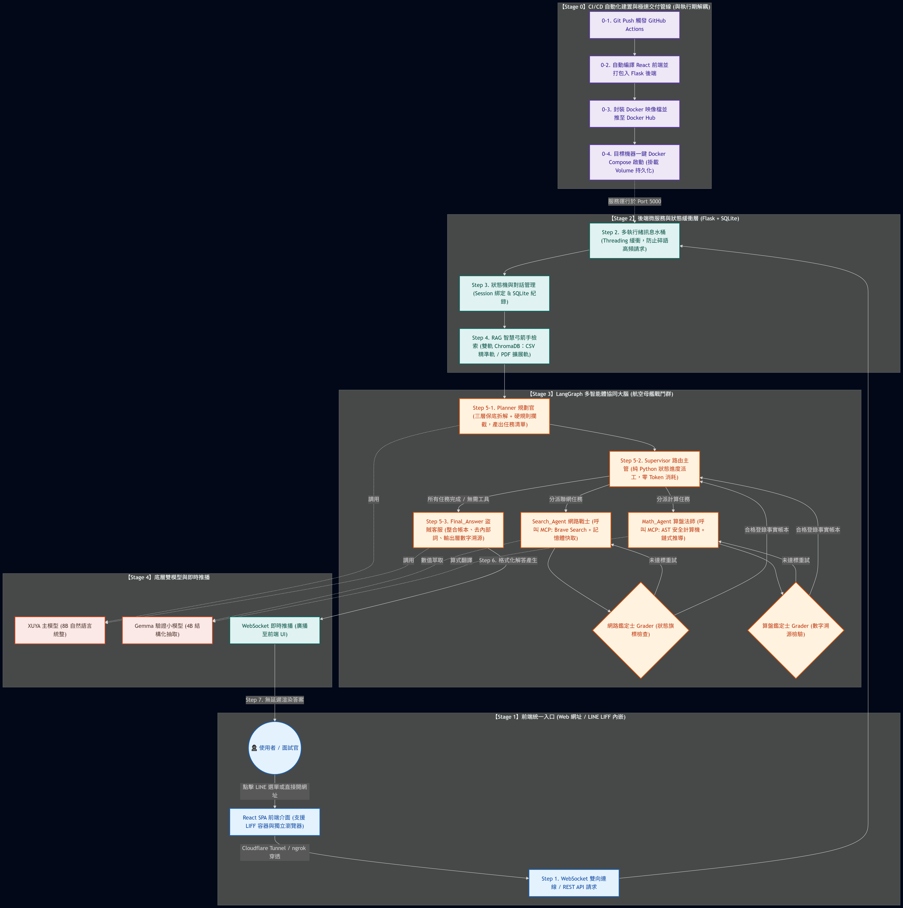

# 全端 AI 智能客服平台 (V3.0 Multi-Agent)

本專案為解決企業既有知識庫稀疏、傳統客服機器人回覆不精準、單體 LLM 易生幻覺與缺乏精準運算等痛點，歷經三代技術演進：從 **V1.0 LINE 企業客服**、**V2.0 Web 全端 AI 助理**，全面升級至 **V3.0 LangGraph 多智能體 (Multi-Agent) 協同架構**。

系統以 **LangGraph 有向圖狀態機** 為中樞大腦，整合 **雙軌 RAG 檢索（獨立艙室）**、**MCP 標準化工具鏈（Brave Search 聯網 / Python AST 安全計算沙盒）**、**雙軌 Grader 物理品質驗收** 與 **GitHub Actions + Docker CI/CD 極速交付管線**，打造具備自主任務規劃、事實查核與自我修復能力的企業級 Agentic AI 解決方案。

---

## 系統架構藍圖 (System Architecture)



---

## 十大核心技術亮點

* **1. CI/CD 自動化建置與 Docker 交付：** 建立 GitHub Actions 自動化流水線，程式碼 Push 即自動編譯 React 前端並注入 Flask 後端封裝為 Docker 映像檔推至 Docker Hub；透過 Docker Compose 設定資料持久化（Volume 掛載）與容器網路橋接（`host.docker.internal` 穿透至宿主機 Ollama），實現目標主機一鍵極速部署。
* **2. WebSocket 即時通訊與多執行緒訊息水桶：** 針對使用者「碎語」連續輸入痛點，實作 5~10 秒滑動視窗緩衝機制，防止高頻併發請求擊垮 AI；透過 WebSocket 實現雙向非同步推播，並內建「真人客服接管」狀態機與閒置計時重置機制。
* **3. RAG 智慧弓箭手（雙軌檢索與主題投票）：** 建置手動精準軌（CSV）與自動擴展軌（PDF）雙軌 ChromaDB。實作「多候選主題投票」與 0.85 距離動態過濾，並採「上下文獨立艙室」設計，避免知識庫雜訊污染其他 Agent 的關鍵字抽取。
* **4. Planner 規劃官（三層保底與硬規則攔截）：** 負責任務開場解析。實作「巢狀 JSON ➔ 兩段式目標提取 ➔ 純 Python 正則啟發式」三層降級保險絲，內建 Prompt 回音雜訊清洗，並在前置硬編碼純數學規則攔截，杜絕無效外部 API 調用。
* **5. Supervisor 路由主管（零 Token 派工）：** 將傳統依賴 LLM 的路由決策降級為純 Python 狀態機。嚴格依據「任務清單 (Plan)」與「事實帳本 (Facts)」管理執行進度，達成 0 運算 Token 消耗、0 幻覺與關鍵字硬去重管控。
* **6. Search_Agent 網路戰士（快取與數值萃取）：** 對接 Brave Search API 檢索外部即時客觀數據。內建行程內記憶體快取（TTL 600s）與自動改寫重試機制，並調用小模型精準萃取結構化數值，直接登錄進事實帳本供下游使用。
* **7. Math_Agent 算盤法師（AST 鏈式推導）：** 將複雜運算任務轉譯為多行 Python 腳本。採用 AST 抽象語法樹沙盒評估與嚴格白名單（僅開放 `comb`/`perm`/`factorial`），支援多變數鏈式依賴推導，徹底封鎖 LLM 心算幻覺。
* **8. 雙軌 Grader 鑑定士（狀態旗標與物理防禦）：** 於專家節點出口實作物理檢驗閘門。捨棄脆弱的內文關鍵字掃描，改以【STATUS:OK/FAIL】旗標判定成敗；算盤鑑定士額外執行「數字溯源」與「數字完整性」驗證，未達標則觸發帶因重試（Self-Correction）。
* **9. Final_Answer 盜賊客服（雙套提示與輸出溯源）：** 依檢索狀況動態切換極簡/完整提示詞，並以正則清理內部骨架詞彙；輸出端實作「最後一棒數字溯源防線」，偵測到未授權數據即觸發重寫或降級套用確定性模板。
* **10. 系統健康檢查與超時守衛：** 提供 `/api/health` 端點，一鍵掃描 Ollama 模型就緒狀態、Brave 金鑰、ChromaDB 向量庫與 LangGraph 圖編譯狀態；搭配 ThreadPool 執行緒超時熔斷保護，避免單一複雜請求阻塞服務主流程。

---

## 系統技術棧 (Tech Stack)

* **前端介面 (Client Layer)：** React 18, Vite, Tailwind CSS (RWD 響應式佈局), LINE LIFF SDK, Mermaid.js
* **後端核心 (Backend Layer)：** Python, Flask, Flask-SocketIO (WebSocket), SQLite, Threading (多執行緒訊息緩衝狀態機)
* **智能體大腦 (Agentic Core)：** LangGraph (狀態圖工作流), LangChain, Pydantic (結構化輸出)
* **模型與算力 (AI Engine)：** Ollama 本地調校（XUYA:8B 自然語言主模型 / Gemma:4B 結構化抽取小模型）, SentenceTransformers
* **知識庫與工具 (RAG & Tools)：** ChromaDB (雙軌向量資料庫), Brave Search API (MCP), Python AST 安全計算沙盒
* **維運與部署 (DevOps & Infra)：** GitHub Actions (CI/CD), Docker, Docker Compose, ngrok / Cloudflare Tunnel

---

## 伺服器部署指南 (生產環境)

本專案已導入 GitHub Actions CI/CD 自動化流水線。當程式碼推送到 `main` 分支時，系統會自動編譯前端並建置最新版 Docker 映像檔至 Docker Hub。

### 首次一鍵部署

請於目標伺服器執行以下步驟：

1. 確保伺服器已安裝 **Docker** (或 Docker Desktop) 與 **Docker Compose**。
2. 確保伺服器已安裝 **Ollama**，並下載對應的大腦模型：
   ```bash
   ollama pull XUYA:latest
   ollama pull gemma3:4b
   ```
3. 下載本專案根目錄的 `docker-compose.prod.yml` 與 `.env` 設定檔至伺服器工作目錄。
4. 將向量知識庫資料夾 `xuya_vdb/` 放入同一個目錄中。
5. 執行以下指令啟動系統服務：
   ```bash
   docker-compose -f docker-compose.prod.yml up -d
   ```
6. 服務啟動後，可於瀏覽器開啟 `http://localhost:5000/api/health` 檢查所有外部依賴項健康狀態。

### 系統更新與快取機制 (Pull)

當 GitHub 倉庫有更新且 CI/CD 流程建置完成後，伺服器端只需執行以下指令即可無縫升級（受惠於 Docker 分層快取，更新過程極為快速）：

```bash
# 1. 抓取雲端最新映像檔 (僅下載有差異的檔案層)
docker-compose -f docker-compose.prod.yml pull

# 2. 重新啟動容器套用更新
docker-compose -f docker-compose.prod.yml up -d
```